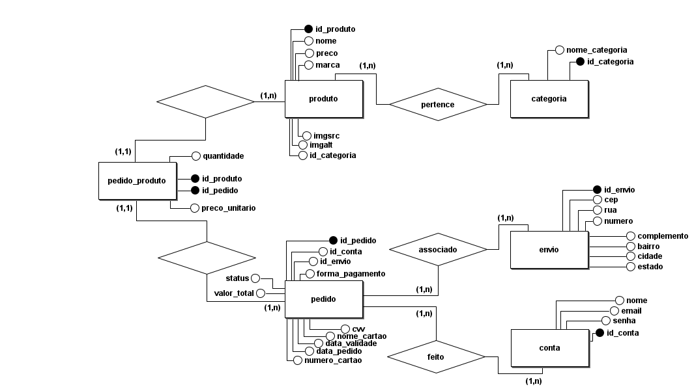

# Documentação da Entrega da Sprint-V

## **Descrição Geral**
Nesta sprint, o objetivo foi praticar a modelagem de banco de dados relacionais e normalizados, com a criação de tabelas em Terceira Forma Normal (3FN), inserção de dados de teste e a realização de consultas SQL, inclusive com junções entre tabelas.

## **Atividades Realizadas**

### **1. Modelagem do DER (Diagrama Entidade-Relacionamento)**
Foi modelado o DER para representar uma parte do sistema, incluindo as seguintes entidades:
- **Pedido**: Representa os pedidos realizados pelos clientes.
- **Produto**: Contém informações sobre os produtos disponíveis.
- **Cliente**: Representa os usuários que realizam os pedidos.
- **Envio**: Contém informações sobre o endereço de entrega dos pedidos.
- **Pedido Produto**: Entidade associativa entre pedido e produto.



#### **Descrição das Entidades**
- **Pedido**:
  - Atributos: `id_pedido`, `id_conta`, `id_envio`, `forma_pagamento`, `status`, `data_pedido`.
- **Produto**:
  - Atributos: `id_produto`, `nome`, `preco`, `descricao`.
- **Cliente**:
  - Atributos: `id_conta`, `nome`, `email`, `telefone`.
- **Envio**:
  - Atributos: `id_envio`, `rua`, `numero`, `bairro`, `cidade`, `estado`.
- **Pedido Produto**:
  - Atributos: `id_pedido_produto`, `id_pedido`, `id_produto`, `quantidade`.


### **2. Criação das Tabelas no Banco de Dados**
As tabelas foram criadas na 3FN (Terceira Forma Normal) para garantir a integridade e evitar redundâncias. Foram inseridas informações de teste para validação.

#### **Exemplo de Criação de Tabelas**

**Tabela `pedido`**:
```sql
CREATE TABLE pedido (
    id_pedido SERIAL PRIMARY KEY,
    id_conta INT NOT NULL,
    id_envio INT NOT NULL,
    forma_pagamento VARCHAR(50),
    status VARCHAR(20),
    data_pedido TIMESTAMP,
    FOREIGN KEY (id_conta) REFERENCES conta(id_conta),
    FOREIGN KEY (id_envio) REFERENCES envio(id_envio)
);
```

**Tabela `produto`**:
```sql
CREATE TABLE produto (
    id_produto SERIAL PRIMARY KEY,
    nome VARCHAR(100),
    preco DECIMAL(10, 2),
    descricao TEXT
);
```

**Tabela `conta`**:
```sql
CREATE TABLE conta (
    id_conta SERIAL PRIMARY KEY,
    nome VARCHAR(100),
    email VARCHAR(100),
    telefone VARCHAR(15)
);
```

**Tabela `envio`**:
```sql
CREATE TABLE envio (
    id_envio SERIAL PRIMARY KEY,
    rua VARCHAR(100),
    numero VARCHAR(10),
    bairro VARCHAR(50),
    cidade VARCHAR(50),
    estado VARCHAR(2)
);
```

**Tabela `pedido_produto`**:
```sql
CREATE TABLE pedido_produto (
    id_pedido_produto SERIAL PRIMARY KEY,
    id_pedido INT NOT NULL,
    id_produto INT NOT NULL,
    quantidade INT NOT NULL,
    FOREIGN KEY (id_pedido) REFERENCES pedido(id_pedido),
    FOREIGN KEY (id_produto) REFERENCES produto(id_produto)
);
```

### **3. Consultas SQL**
Foram realizadas consultas simples e avançadas, incluindo junções entre tabelas para exibir informações completas.

#### **Consultas Implementadas**

**Consulta de Pedidos e Produtos**

Exibe os pedidos com os produtos associados, incluindo quantidade e preço.

Exemplo de consulta:
```sql
SELECT
    p.id_pedido,
    pr.nome AS nome_produto,
    pp.quantidade,
    pr.preco
FROM pedido p
JOIN pedido_produto pp ON p.id_pedido = pp.id_pedido
JOIN produto pr ON pp.id_produto = pr.id_produto
ORDER BY p.id_pedido;
```

**Consulta Detalhada de Pedidos**

Exibe informações detalhadas de cada pedido, incluindo:
- Nome do cliente
- Produtos comprados (nome, quantidade e preço)
- Forma de pagamento
- Status do pedido
- Endereço de envio formatado
- Data do pedido

Exemplo de consulta:
```sql
SELECT
    pe.id_pedido,
    c.nome AS nome_cliente,
    pr.nome AS nome_produto,
    pp.quantidade,
    pr.preco,
    pe.forma_pagamento,
    pe.status,
    e.rua || ', ' || e.numero || ' - ' || e.bairro || ', ' || e.cidade || '/' || e.estado AS endereco_envio,
    pe.data_pedido
FROM pedido pe
JOIN conta c ON pe.id_conta = c.id_conta
JOIN envio e ON pe.id_envio = e.id_envio
JOIN pedido_produto pp ON pe.id_pedido = pp.id_pedido
JOIN produto pr ON pp.id_produto = pr.id_produto
ORDER BY pe.id_pedido;
```